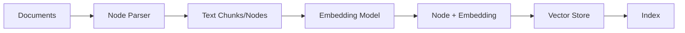
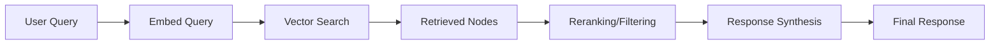
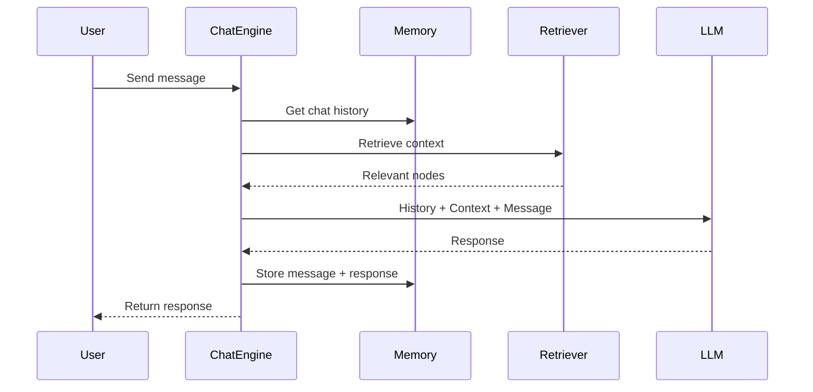

LlamaIndex.TS processes data through a series of transformations, from raw documents to indexed embeddings to final query responses. Understanding this flow is crucial for building effective LLM applications.

## Overview

The data flow consists of two main pipelines:

<CardGroup cols={2}>
  <Card title="Ingestion Pipeline" icon="download">
    Document → Nodes → Embeddings → Vector Store
  </Card>
  <Card title="Query Pipeline" icon="search">
    Query → Embedding → Retrieval → Synthesis → Response
  </Card>
</CardGroup>

## Ingestion Pipeline

The ingestion pipeline transforms raw documents into searchable vector embeddings.



### Step 1: Document Loading

```typescript Load documents
import { Document } from "llamaindex";

// Create documents from text
const documents = [
  new Document({ 
    text: "LlamaIndex is a data framework for LLM applications.",
    metadata: { source: "docs", page: 1 }
  }),
  new Document({ 
    text: "It provides tools for data ingestion, indexing, and querying.",
    metadata: { source: "docs", page: 2 }
  }),
];

// Or load from files
import { SimpleDirectoryReader } from "llamaindex";
const reader = new SimpleDirectoryReader();
const docs = await reader.loadData({ directoryPath: "./documents" });
```

**Document Structure:**

```typescript From @llamaindex/core/schema/node.ts
export class Document extends TextNode {
  id_: string;           // Unique document ID
  text: string;          // Document content
  metadata: Metadata;    // Arbitrary metadata
  embedding?: number[];  // Optional embedding
  relationships: {...};  // Links to other nodes
}
```

### Step 2: Node Parsing (Chunking)

Documents are split into smaller chunks called **Nodes**:

```typescript Node parsing
import { SentenceSplitter, Settings } from "llamaindex";

// Configure the node parser
Settings.nodeParser = new SentenceSplitter({
  chunkSize: 1024,      // Max tokens per chunk
  chunkOverlap: 200,    // Overlap between chunks
});

// Parse documents into nodes
const nodes = await Settings.nodeParser(documents);
```

**Why chunk documents?**

<AccordionGroup>
  <Accordion title="Context Window Limits">
    LLMs have maximum context windows (e.g., 4K, 8K, 128K tokens). Chunking ensures content fits within these limits.
  </Accordion>
  
  <Accordion title="Semantic Coherence">
    Smaller chunks often represent more coherent semantic units, improving retrieval accuracy.
  </Accordion>
  
  <Accordion title="Granular Retrieval">
    Fine-grained chunks allow more precise retrieval of relevant information.
  </Accordion>
</AccordionGroup>

**Node Structure:**

```typescript BaseNode from @llamaindex/core/schema
abstract class BaseNode<T extends Metadata = Metadata> {
  id_: string;                    // Unique node ID
  embedding?: number[];           // Vector embedding
  metadata: T;                    // Inherited + additional metadata
  excludedEmbedMetadataKeys: string[];  // Keys to exclude from embedding
  excludedLlmMetadataKeys: string[];    // Keys to exclude from LLM
  relationships: Record<NodeRelationship, RelatedNodeType>;
  hash: string;                   // Content hash for deduplication
  
  abstract getContent(metadataMode: MetadataMode): string;
}
```

### Step 3: Embedding Generation

Each node is converted to a vector embedding:

```typescript Generate embeddings
import { Settings } from "llamaindex";
import { OpenAIEmbedding } from "@llamaindex/openai";

Settings.embedModel = new OpenAIEmbedding({
  model: "text-embedding-3-large",
  dimensions: 1024,
});

// Embeddings are generated automatically during indexing
const index = await VectorStoreIndex.fromDocuments(documents);
```

**How it works:**

```typescript From packages/llamaindex/src/indices/vectorStore/index.ts
async getNodeEmbeddingResults(nodes: BaseNode[]): Promise<BaseNode[]> {
  const nodeMap = splitNodesByType(nodes);
  for (const type in nodeMap) {
    const nodes = nodeMap[type as ModalityType];
    const embedModel = this.vectorStores[type]?.embedModel ?? this.embedModel;
    if (embedModel && nodes) {
      await embedModel(nodes, {
        logProgress: options?.logProgress,
      });
    }
  }
  return nodes;
}
```

<Info>
Embeddings are **vector representations** of text that capture semantic meaning. Similar texts have similar embeddings.
</Info>

### Step 4: Vector Store Insertion

Nodes with embeddings are stored in a vector database:

```typescript Store in vector database
import { VectorStoreIndex } from "llamaindex";
import { PineconeVectorStore } from "@llamaindex/pinecone";

const vectorStore = new PineconeVectorStore({
  apiKey: process.env.PINECONE_API_KEY,
  indexName: "my-index",
});

const index = await VectorStoreIndex.fromDocuments(documents, {
  vectorStores: { TEXT: vectorStore },
});
```

**What gets stored:**

- Node ID
- Embedding vector
- Node content (if `storesText: true`)
- Metadata for filtering

### Complete Ingestion Example

```typescript Full ingestion pipeline
import { 
  Settings, 
  VectorStoreIndex, 
  Document,
  SentenceSplitter 
} from "llamaindex";
import { OpenAI, OpenAIEmbedding } from "@llamaindex/openai";
import { PineconeVectorStore } from "@llamaindex/pinecone";

// 1. Configure Settings
Settings.llm = new OpenAI({ model: "gpt-4" });
Settings.embedModel = new OpenAIEmbedding({ model: "text-embedding-3-large" });
Settings.nodeParser = new SentenceSplitter({ chunkSize: 1024, chunkOverlap: 200 });

// 2. Create documents
const documents = [
  new Document({ text: "Your content here...", metadata: { source: "doc1" } }),
];

// 3. Create vector store
const vectorStore = new PineconeVectorStore({
  apiKey: process.env.PINECONE_API_KEY!,
  indexName: "llamaindex-demo",
});

// 4. Build index (automatically handles steps 2-4)
const index = await VectorStoreIndex.fromDocuments(documents, {
  vectorStores: { TEXT: vectorStore },
  logProgress: true,  // Show progress in console
});

console.log("Ingestion complete!");
```

## Advanced: IngestionPipeline

For more control, use the `IngestionPipeline`:

```typescript Custom ingestion pipeline
import { IngestionPipeline } from "llamaindex/ingestion";
import { SentenceSplitter } from "llamaindex";
import { TitleExtractor, SummaryExtractor } from "llamaindex/extractors";

const pipeline = new IngestionPipeline({
  transformations: [
    new SentenceSplitter({ chunkSize: 1024 }),
    new TitleExtractor(),     // Extract titles from content
    new SummaryExtractor(),   // Generate summaries
  ],
  vectorStores: { TEXT: vectorStore },
});

const nodes = await pipeline.run({ documents });
```

**Pipeline features:**

<CodeGroup>

```typescript Caching
const pipeline = new IngestionPipeline({
  transformations: [...],
  vectorStores: { TEXT: vectorStore },
  disableCache: false,  // Enable caching (default)
});

// Cached transformations are reused
await pipeline.run({ documents });
```

```typescript Document Store Strategy
import { DocStoreStrategy } from "llamaindex/ingestion";

const pipeline = new IngestionPipeline({
  transformations: [...],
  docStore: documentStore,
  docStoreStrategy: DocStoreStrategy.UPSERTS,  // Handle duplicates
});
```

```typescript Custom Transformations
import type { TransformComponent } from "@llamaindex/core/schema";

const customTransform: TransformComponent = async (nodes) => {
  // Custom node processing logic
  return nodes.map(node => {
    node.metadata.processed = true;
    return node;
  });
};

const pipeline = new IngestionPipeline({
  transformations: [
    new SentenceSplitter({ chunkSize: 1024 }),
    customTransform,
  ],
});
```

</CodeGroup>

## Query/Retrieval Pipeline

The query pipeline retrieves relevant nodes and synthesizes responses.



### Step 1: Query Embedding

```typescript Query embedding
const query = "What is LlamaIndex?";

// Query is embedded using the same embedding model
const queryEmbedding = await Settings.embedModel.getQueryEmbedding(query);
```

<Warning>
Always use the **same embedding model** for indexing and querying to ensure compatibility.
</Warning>

### Step 2: Vector Similarity Search

```typescript Retrieve similar nodes
const retriever = index.asRetriever({ similarityTopK: 5 });
const nodesWithScores = await retriever.retrieve({ query });

// Returns nodes ranked by similarity
nodesWithScores.forEach(({ node, score }) => {
  console.log(`Score: ${score}, Text: ${node.text}`);
});
```

**From VectorIndexRetriever:**

```typescript packages/llamaindex/src/indices/vectorStore/index.ts
protected async retrieveQuery(
  query: MessageContent,
  type: ModalityType,
  vectorStore: BaseVectorStore,
): Promise<NodeWithScore[]> {
  // 1. Embed the query
  const embedModel = this.index.embedModel ?? vectorStore.embedModel;
  const queryEmbedding = await embedModel.getQueryEmbedding(query);
  
  // 2. Query vector store
  const result = await vectorStore.query({
    queryStr,
    queryEmbedding,
    mode: this.queryMode,
    similarityTopK: this.topK[type],
    filters: this.filters,
  });
  
  // 3. Build nodes with scores
  return this.buildNodeListFromQueryResult(result);
}
```

### Step 3: Response Synthesis

Retrieved nodes are sent to the LLM to generate a response:

```typescript Query engine
const queryEngine = index.asQueryEngine();
const response = await queryEngine.query({ 
  query: "What is LlamaIndex?" 
});

console.log(response.toString());
```

**What happens:**

1. Query is embedded
2. Top-K similar nodes are retrieved
3. Nodes are formatted into a context
4. LLM generates response using context + query

### Step 4: Post-Processing (Optional)

Apply reranking or filtering:

```typescript Reranking
import { SimilarityPostprocessor } from "llamaindex/postprocessors";

const queryEngine = index.asQueryEngine({
  nodePostprocessors: [
    new SimilarityPostprocessor({ similarityCutoff: 0.7 })
  ],
});
```

## Complete Query Example

```typescript Full query pipeline
import { VectorStoreIndex, Settings } from "llamaindex";
import { OpenAI, OpenAIEmbedding } from "@llamaindex/openai";

// Configure (same as ingestion)
Settings.llm = new OpenAI({ model: "gpt-4" });
Settings.embedModel = new OpenAIEmbedding({ model: "text-embedding-3-large" });

// Load existing index
const index = await VectorStoreIndex.fromVectorStore(vectorStore);

// Create query engine
const queryEngine = index.asQueryEngine({
  similarityTopK: 3,  // Retrieve top 3 nodes
});

// Query
const response = await queryEngine.query({
  query: "How does LlamaIndex handle data ingestion?"
});

console.log("Response:", response.toString());
console.log("Source Nodes:", response.sourceNodes?.length);
```

## Chat Engine Flow

Chat engines maintain conversation history:

```typescript Chat engine
const chatEngine = index.asChatEngine();

// First message
const response1 = await chatEngine.chat({
  message: "What is LlamaIndex?"
});

// Follow-up (uses history)
const response2 = await chatEngine.chat({
  message: "How do I install it?"
});
```

**Chat flow:**



## Streaming Responses

Stream responses for better UX:

```typescript Streaming
const queryEngine = index.asQueryEngine();

const stream = await queryEngine.query({
  query: "Explain LlamaIndex",
  stream: true,
});

for await (const chunk of stream) {
  process.stdout.write(chunk.delta);
}
```

## Data Flow Optimization

<CardGroup cols={2}>
  <Card title="Chunk Size" icon="scissors">
    Smaller chunks = more precise retrieval but more chunks to search
    
    Larger chunks = more context but less precision
  </Card>
  
  <Card title="Top-K" icon="ranking-star">
    Higher K = more context but slower and more expensive
    
    Lower K = faster but might miss relevant info
  </Card>
  
  <Card title="Embedding Model" icon="brain">
    Better embeddings = better retrieval accuracy
    
    Larger dimensions = more accurate but slower
  </Card>
  
  <Card title="Reranking" icon="filter">
    Post-retrieval reranking improves precision
    
    Use similarity cutoff to filter low-quality matches
  </Card>
</CardGroup>

## Best Practices

<Steps>
  <Step title="Consistent Embeddings">
    Use the same embedding model for both indexing and querying
  </Step>
  
  <Step title="Optimal Chunk Size">
    Test different chunk sizes (512, 1024, 2048) for your use case
  </Step>
  
  <Step title="Metadata Filtering">
    Use metadata to filter retrieval results (e.g., by date, source, category)
  </Step>
  
  <Step title="Monitor Performance">
    Track retrieval quality with evaluation metrics
  </Step>
  
  <Step title="Cache Embeddings">
    Use IngestionPipeline caching to avoid re-embedding unchanged documents
  </Step>
</Steps>

## Next Steps

<CardGroup cols={3}>
  <Card title="Vector Indices" icon="database" href="/modules/indices/vector-store-index">
    Deep dive into VectorStoreIndex configuration and usage
  </Card>
  <Card title="Query Engines" icon="magnifying-glass" href="/modules/query-engines">
    Learn about different query engine types and customization
  </Card>
  <Card title="Ingestion Pipeline" icon="pipe" href="/modules/ingestion">
    Advanced ingestion pipeline patterns and transformations
  </Card>
</CardGroup>